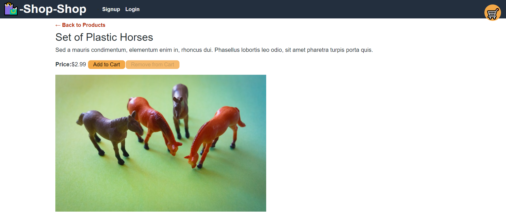
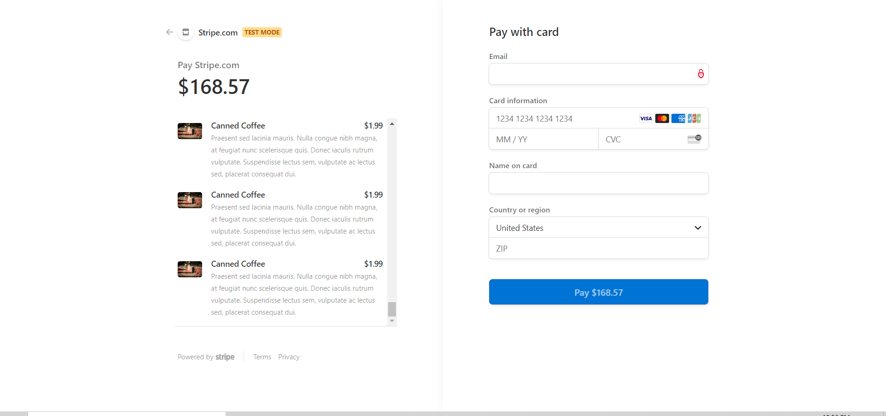

# Shop-Shop 

## Description

 

[Shop-Shop](https://lychee-custard-01769.herokuapp.com/) Click here to open application

 

**Shop-Shop** is an ecommerce site refactored to use **Redux** instead of **Context API** to manage *global state*. 

 

## Acceptance Criteria

 

GIVEN an e-commerce platform that uses Redux to manage global state
- WHEN I review the app’s store
    - [x] THEN I find that the app uses a Redux store instead of the Context API
- WHEN I review the way the React front end accesses the store
    - [x] THEN I find that the app uses a Redux provider
- WHEN I review the way the app determines changes to its global state
    - [x] THEN I find that the app passes reducers to a Redux store instead of using the Context API
- WHEN I review the way the app extracts state data from the store
    - [x] THEN I find that the app uses Redux instead of the Context API
- WHEN I review the way the app dispatches actions
    - [x] THEN I find that the app uses Redux instead of the Context API

 

## **Table of Contents**

 

* *[Installation](#installation)*
* *[Screenshots](#screenshots)*
* *[Usage Instructions](#usage-instructions)*
* *[Contributing](#contributing)*
* *[Technology](#technology)*
* *[Tests](#tests)*
* *[Questions](#questions)*
* *[License](#license)*

 

## **Installation**

 

After cloning/forking the applications use the command `npm i` or `npm install` to download the necessary dependencies.

 

## **Screenshots**

 

 

 

 

## **Usage-instructions**

 

To test this application, or to run it locally use the command `npm start` to activate the react server.  It redering is successfull and there are no error messages in the terminal a new tab with the app will pop up.     

 

## **Contributing**

 

Please refer to the **[Contributor Covenant](https://www.contributor-covenant.org/)** for contribution guidelines.

 

## **Technology**

 

**This refactor was completed using:** 

  

` - Redux`  
` - React-Redux`

 

## **Tests**  

 

No test need to be run at this time. 

 

## **Questions**

 

For any questions, comments, or feedback please feel free to reach out:  
- **[Github](https://github.com/gintstir)** 
- **<gint.stirbys@gmail.com>**

 

## **License** 

 

Copyright © **Gintautas Stirbys**, **2021**.  All Rights Reserved.

This Project is licensed under the **[Apache~2.0](https://www.apache.org/licenses/LICENSE-2.0)** license.
